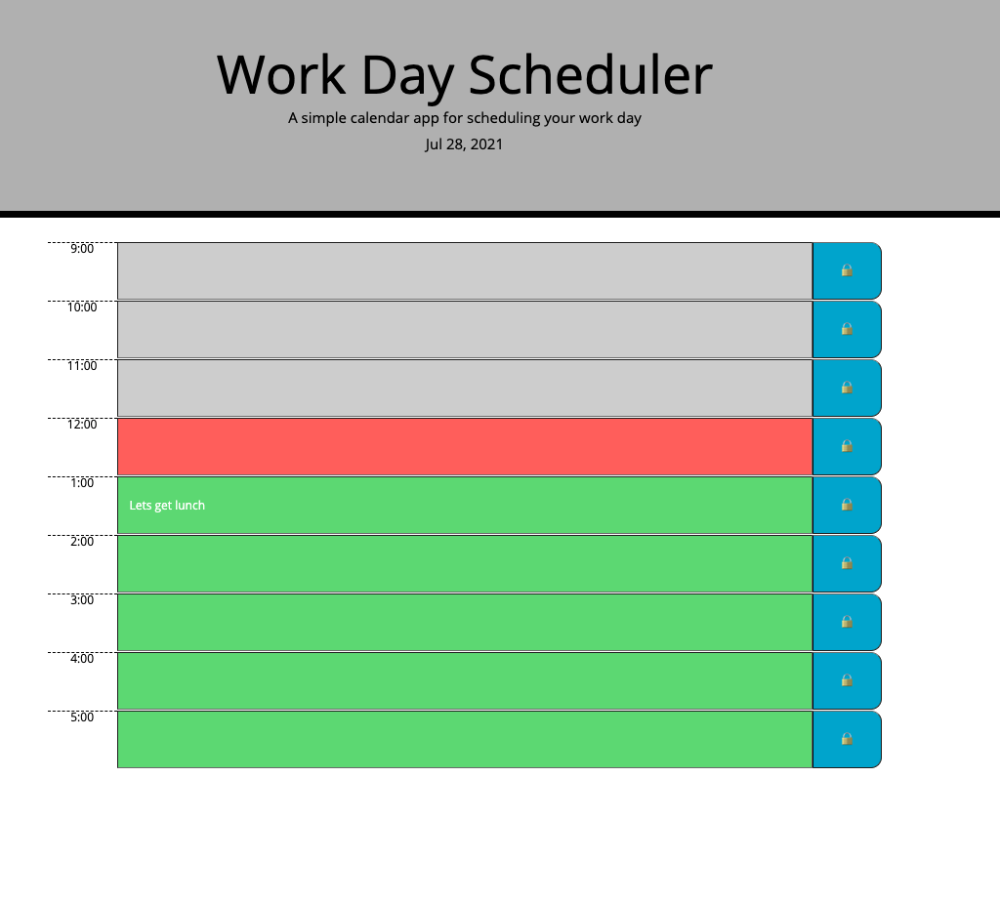

# a-simple-calendar

- What was your motivation? 
I got to learn the basics of jquery and bootstrap for this project. Each of these are extensions of JavaScript and can be added on to make several features run automatically. While these are no longer used in modern development they are important to know because you find them in legacy code. 

- Why did you build this project?
This app is a simple calendar project that keeps track of the current day using moment. The current time is is reflected by a classes which are each a different color. Using jquery I referenced each class and used and if/else statement to determine if the time was past/present/future. 

- What problem does it solve? This is a simple day planner for keeping track of your to do list and the current date and time. It uses moment, and jquery, and different css classes to show this. 

- What did you learn? For this project I got down some basics of jquery and bootstrap. I got to further practice javascript by using children, parents, and siblings. Also got to work more with assigning attributes and learning the specific syntax. This project also worked with local storage and how to save text input. 

## Here is a preview of my work:

## Here is a link to my work:
[See it here](https://jilliankayworks.github.io/a-simple-calendar/)

## Table of Contents 
- [Installation](#installation)
- [Usage](#usage)
- [Credits](#credits)
- [License](#license)
## Installation
modern web browser 
## Usage
a simple calendar for your work day 
## Credits
DU Bootcamp 
## License
MIT 

